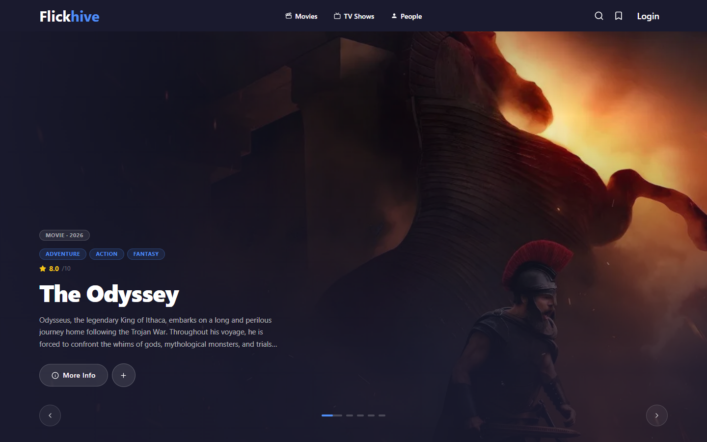
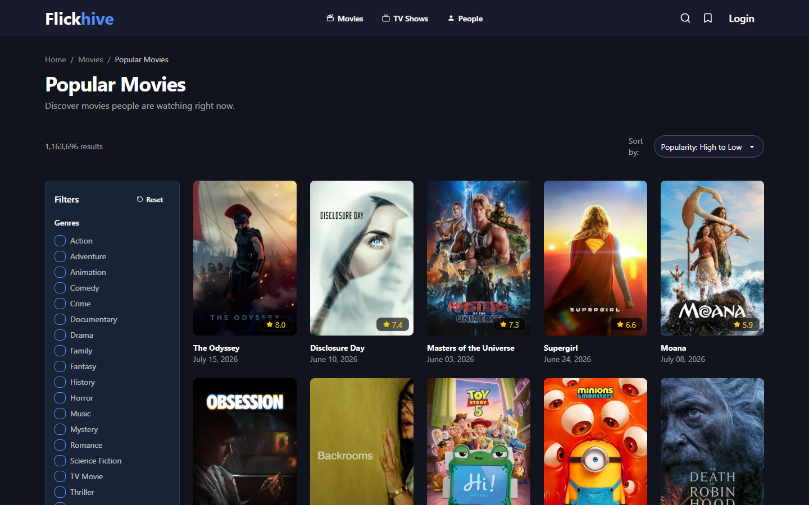
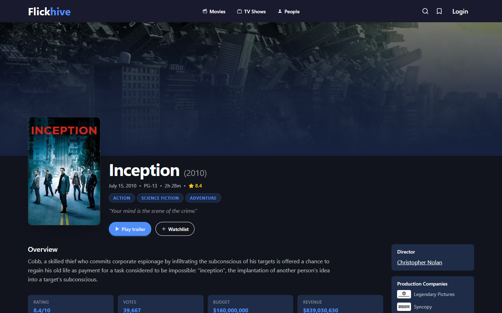
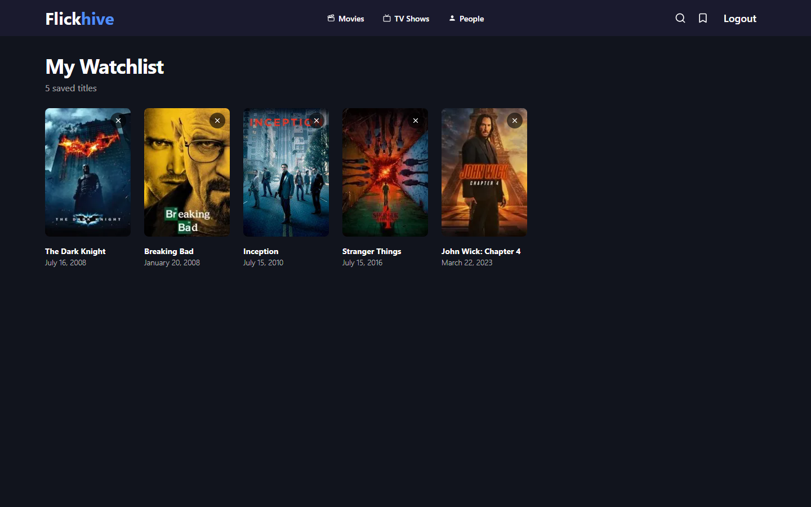
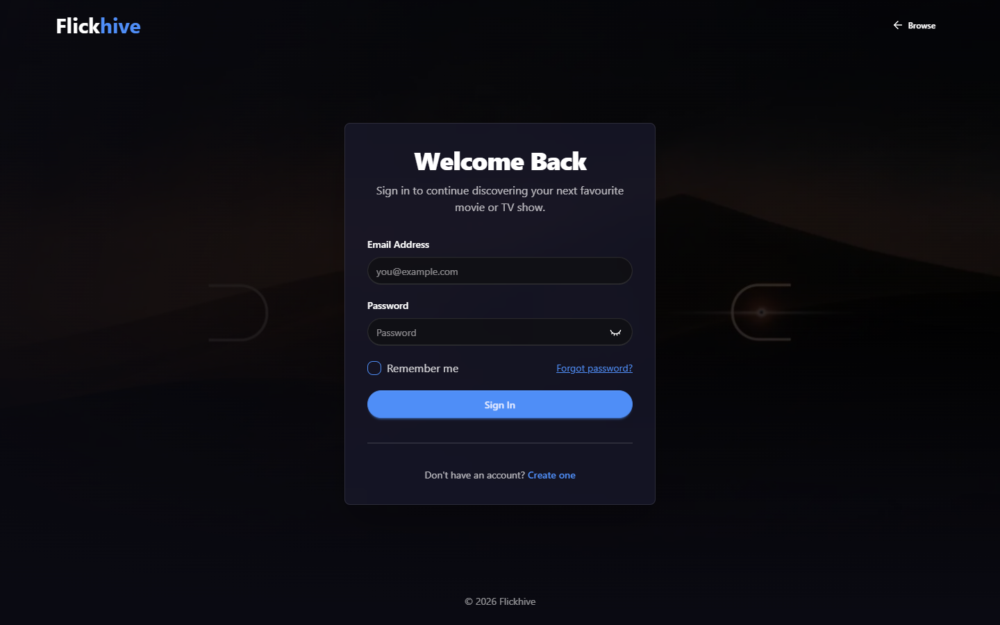

# Flickhive

Browse movies and TV shows, dig into cast/crew and season details, and keep
a personal watchlist — powered by [TMDB](https://www.themoviedb.org/) data
on the frontend and a small Node/Express/MongoDB API for auth and watchlists.

## Screenshots

| | |
|---|---|
|  |  |
|  |  |

<details>
<summary>Login</summary>



</details>

## Features

- Home page with a hero slideshow plus trending/popular/top-rated/discover
  carousels
- Browse movies, TV shows, and people with genre filters, sorting, and
  pagination
- Search across movies, TV shows, and people
- Movie, TV, season, and person detail pages, including full cast & crew
- Trailer playback
- Email/password auth with JWT access + refresh tokens in httpOnly cookies
  ("remember me" support)
- Personal watchlist — add/remove movies and TV shows, persisted per user

## Tech stack

**Backend** — Node.js, Express 5, MongoDB + Mongoose 9, JSON Web Tokens +
bcrypt, Joi validation, express-rate-limit

**Frontend** — React 19, Vite 8, React Router 7, Tailwind CSS v4 + DaisyUI 5,
Axios, TMDB API

## Project structure

```
backend/    Express API — routes → controllers → services → repositories → models
frontend/   React app (Vite), calls TMDB directly and the backend for auth/watchlist
docs/       Screenshots used in this README
```

## Prerequisites

- Node.js 18+
- A running MongoDB instance (local or [Atlas](https://www.mongodb.com/atlas))
- A free [TMDB API](https://www.themoviedb.org/documentation/api) account and
  API Read Access Token

## Local setup

```bash
git clone <this-repo>
cd Flickhive

cd backend && npm install
cd ../frontend && npm install
```

Copy the example env files and fill in real values:

```bash
cp backend/.env.example backend/.env
cp frontend/.env.example frontend/.env
```

**`backend/.env`**

| Variable | Description |
|---|---|
| `PORT` | Port the API listens on (default `5004`) |
| `MONGO_URI` | MongoDB connection string |
| `CORS_ORIGIN` | Allowed frontend origin, e.g. `http://localhost:5173` |
| `SECRET_ACCESS_TOKEN` | JWT signing secret for the access token |
| `SECRET_REFRESH_TOKEN` | JWT signing secret for the refresh token |
| `NODE_ENV` | `development` or `production` |

**`frontend/.env`**

| Variable | Description |
|---|---|
| `VITE_API_BASE_URL` | Base URL of the backend API, e.g. `http://localhost:5004` |
| `VITE_TMDB_BASE_URL` | TMDB API base URL, e.g. `https://api.themoviedb.org/3` |
| `VITE_TMDB_TOKEN` | TMDB API Read Access Token |
| `VITE_IMG` | TMDB image base URL |
| `VITE_YOUTUBE_THUMBNAIL` | YouTube thumbnail base URL |
| `VITE_CLOUD_NAME` | Present in setup but not currently used by the app — see Known limitations |

Run both dev servers (two terminals):

```bash
cd backend && npm run dev    # http://localhost:5004
cd frontend && npm run dev   # http://localhost:5173
```

## Demo account

To try login-gated features (the watchlist) without creating your own
account, seed a demo user with a few pre-added watchlist items:

```bash
cd backend
npm run seed:demo
```

Then sign in with:

| Email | Password |
|---|---|
| `demo@flickhive.dev` | `FlickhiveDemo123!` |

This is non-sensitive demo data — safe to re-run the seed command any time
(it's idempotent).

## Available scripts

**`backend/`**

| Script | Description |
|---|---|
| `npm start` | Run the API with plain Node |
| `npm run dev` | Run the API with nodemon (auto-restart) |
| `npm run seed:demo` | Seed the demo account and its watchlist |
| `npm test` | Not implemented yet |

**`frontend/`**

| Script | Description |
|---|---|
| `npm run dev` | Start the Vite dev server |
| `npm run build` | Production build |
| `npm run lint` | Run ESLint |
| `npm run preview` | Preview a production build locally |

## API overview

| Route group | Description |
|---|---|
| `POST /api/auth/signup` | Create an account |
| `POST /api/auth/login` | Log in (optional `rememberMe` for a refresh token) |
| `POST /api/auth/logout` | Log out |
| `POST /api/auth/refresh` | Rotate the access token using the refresh token |
| `GET /api/auth/me` | Get the current user |
| `GET /api/watchlist` | List the current user's watchlist |
| `POST /api/watchlist` | Add an item to the watchlist |
| `DELETE /api/watchlist/:mediaId` | Remove an item from the watchlist |

All `/api/watchlist/*` routes and `GET /api/auth/me` / `POST /api/auth/logout`
require a valid access token cookie.

## Known limitations

- `VITE_TMDB_TOKEN` is bundled client-side (any `VITE_`-prefixed var ships to
  the browser), so it's visible in devtools. Acceptable for now — see the
  Decisions section in `CURRENT_TASK.md` if that changes.
- No automated test suite yet (`backend`'s `test` script is a placeholder).
- `VITE_CLOUD_NAME` exists in the env setup but isn't referenced anywhere in
  the current frontend code — likely a leftover from earlier exploration.

## Deployment

Not yet deployed. This section will be updated with a live URL once it is.

## License

MIT — see [LICENSE](LICENSE).

## Contributing

Solo portfolio project — not currently open to outside contributions.
